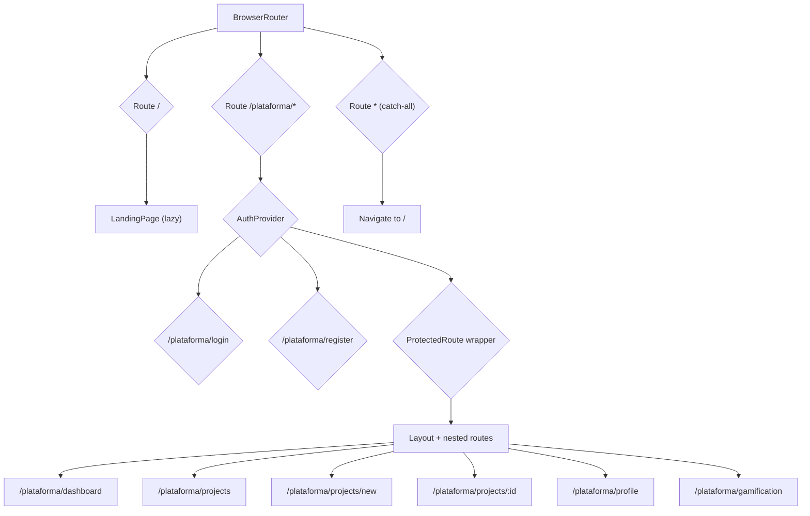
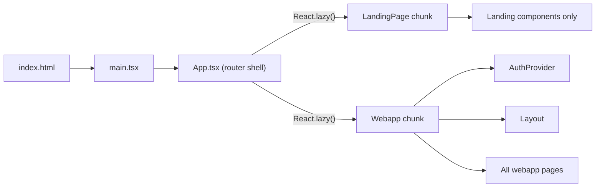

# Design Document: Landing Page Integration

## Overview

This design describes the architecture and implementation plan for integrating a public-facing landing page into the existing Instituto de Impacto Social México webapp. The feature introduces a marketing landing page at the root URL (`/`) and reorganizes all existing authenticated webapp routes under the `/plataforma` prefix.

The landing page communicates the organization's mission, programs, impact statistics, and testimonials to prospective participants (university students aged 18–25). It is entirely static content with no dependency on Supabase or authentication state, enabling fast initial page loads and code-splitting separation from the webapp.

### Key Design Decisions

1. **Route reorganization via prefix**: All authenticated webapp routes move to `/plataforma/*` to clearly separate public content from the application. This is implemented at the React Router level within the same SPA.
2. **Code-splitting boundary**: The landing page and webapp are loaded as separate Vite chunks via React.lazy(), ensuring the landing page never imports Supabase, AuthContext, or any authenticated component code.
3. **Component isolation**: Landing page components live in `src/pages/landing/` with their own CSS Modules, fully independent from the existing `src/pages/` and `src/components/` directories used by the webapp.
4. **SEO via react-helmet-async**: Dynamic meta tags are injected at the component level using `react-helmet-async`, while base meta tags remain in `index.html` for crawlers that don't execute JS.
5. **No new dependencies beyond react-helmet-async**: The landing page uses native scroll APIs, CSS animations, and the existing lucide-react icon library. No animation or carousel libraries are added.

## Architecture

### Route Architecture



### Key Architectural Principle

The `AuthProvider` wraps only the `/plataforma/*` routes, not the entire app. This ensures the landing page at `/` never triggers Supabase session loading and remains fully independent of authentication state.

### Code-Splitting Strategy



The Vite build produces at minimum two major chunks:
- **Landing chunk**: LandingPage + its sub-components and CSS
- **Webapp chunk**: AuthProvider, Supabase client, Layout, all authenticated pages

## Components and Interfaces

### New File Structure

```
src/
├── App.tsx                          (modified: new route structure)
├── main.tsx                         (unchanged)
├── pages/
│   ├── landing/
│   │   ├── LandingPage.tsx          (main landing page composition)
│   │   ├── LandingPage.module.css
│   │   ├── Navbar.tsx               (fixed nav with scroll behavior)
│   │   ├── Navbar.module.css
│   │   ├── HeroSection.tsx
│   │   ├── HeroSection.module.css
│   │   ├── MisionSection.tsx
│   │   ├── MisionSection.module.css
│   │   ├── ProgramasSection.tsx
│   │   ├── ProgramasSection.module.css
│   │   ├── ImpactoSection.tsx
│   │   ├── ImpactoSection.module.css
│   │   ├── TestimoniosSection.tsx
│   │   ├── TestimoniosSection.module.css
│   │   ├── FinalCTA.tsx
│   │   ├── FinalCTA.module.css
│   │   ├── Footer.tsx
│   │   └── Footer.module.css
│   ├── Login.tsx                    (unchanged)
│   ├── Register.tsx                 (unchanged)
│   ├── Dashboard.tsx                (unchanged)
│   └── ...                          (all other pages unchanged)
├── components/
│   └── Layout.tsx                   (modified: nav links prefix /plataforma)
└── context/
    └── AuthContext.tsx              (unchanged)
```

### Component Interfaces

#### App.tsx (Modified)

```typescript
// Lazy-loaded route boundaries
const LandingPage = React.lazy(() => import('./pages/landing/LandingPage'));
const WebappShell = React.lazy(() => import('./WebappShell'));

function AppRoutes() {
  return (
    <Routes>
      {/* Public landing page — no auth context */}
      <Route path="/" element={
        <Suspense fallback={<LoadingSpinner />}>
          <LandingPage />
        </Suspense>
      } />

      {/* Webapp under /plataforma — wrapped in AuthProvider */}
      <Route path="/plataforma/*" element={
        <Suspense fallback={<LoadingSpinner />}>
          <WebappShell />
        </Suspense>
      } />

      {/* Catch-all: redirect to landing */}
      <Route path="*" element={<Navigate to="/" replace />} />
    </Routes>
  );
}
```

#### WebappShell.tsx (New)

Encapsulates `AuthProvider` and all webapp routes:

```typescript
interface WebappShellProps {}

export default function WebappShell() {
  return (
    <AuthProvider>
      <WebappRoutes />
    </AuthProvider>
  );
}

function WebappRoutes() {
  const { user } = useAuth();

  return (
    <Routes>
      <Route path="login" element={user ? <Navigate to="/plataforma/dashboard" /> : <Login />} />
      <Route path="register" element={user ? <Navigate to="/plataforma/dashboard" /> : <Register />} />
      <Route path="/" element={<ProtectedRoute><Layout /></ProtectedRoute>}>
        <Route index element={<Navigate to="/plataforma/dashboard" replace />} />
        <Route path="dashboard" element={<Dashboard />} />
        <Route path="projects" element={<Projects />} />
        <Route path="projects/new" element={<NewProject />} />
        <Route path="projects/:id" element={<ProjectDetail />} />
        <Route path="profile" element={<Profile />} />
        <Route path="gamification" element={<Gamification />} />
      </Route>
      <Route path="*" element={<Navigate to="/plataforma/dashboard" replace />} />
    </Routes>
  );
}
```

#### LandingPage.tsx

```typescript
interface LandingPageProps {}

export default function LandingPage(): JSX.Element;
// Renders: Navbar, HeroSection, MisionSection, ProgramasSection,
//          ImpactoSection, TestimoniosSection, FinalCTA, Footer
// Semantic structure: <header>, <nav>, <main>, <section>*, <footer>
// Manages: Helmet for SEO meta tags
```

#### Navbar.tsx

```typescript
interface NavbarProps {}

// State: scrolled (boolean) — tracks scroll position > 100px
// Behavior: transparent background when scrollY ≤ 100px,
//           solid --primary when scrollY > 100px
// Mobile: hamburger menu toggle, full-screen overlay
// Links: section anchors (smooth scroll) + /plataforma/login, /plataforma/register
```

#### HeroSection.tsx

```typescript
interface HeroSectionProps {}

// Displays: logo (with fallback text), headline, subheadline, CTA button
// CTA navigates to: /plataforma/register
// Background: --primary or gradient using --primary
// Logo error handling: onError → show text fallback
```

#### Footer.tsx

```typescript
interface FooterProps {}

// Displays: logo, org name, contact email (mailto:), social links (target="_blank"),
//           copyright with dynamic year
// Background: --primary-dark (#0f1f33)
// Social links: configurable array, rendered conditionally
```

### Modified Components

#### Layout.tsx

Navigation link paths updated from `/dashboard` → `/plataforma/dashboard`, `/projects` → `/plataforma/projects`, etc. The `handleSignOut` redirects to `/plataforma/login` instead of `/login`.

## Data Models

### Static Content Model

The landing page uses no backend data. All content is defined as static TypeScript constants within the components or in a shared data file:

```typescript
// src/pages/landing/data.ts

interface ProgramCard {
  icon: string;        // lucide-react icon name
  title: string;       // max 60 characters
  description: string; // max 120 characters
}

interface ImpactStat {
  value: string;       // numeric display value (e.g., "500+")
  label: string;       // descriptive label
}

interface Testimonial {
  projectName: string;
  statistic: string;
  quote: string;       // max 280 characters
  authorName: string;
  authorRole: string;
}

interface SocialLink {
  platform: string;
  url: string;
  icon: string;        // lucide-react icon name
  label: string;
}

export const programas: ProgramCard[];
export const impactStats: ImpactStat[];
export const testimonials: Testimonial[];
export const socialLinks: SocialLink[];
export const contactEmail: string;
```

### SEO Metadata Model

```typescript
interface SEOMetadata {
  title: string;
  description: string;   // 150–160 characters
  canonicalUrl: string;
  ogImage: string;       // ≥1200×630px image URL
  ogType: 'website';
  twitterCard: 'summary_large_image';
}
```

### PWA Manifest Changes

```json
{
  "start_url": "/plataforma/dashboard",
  "scope": "/"
}
```

## Error Handling

| Scenario | Handling Strategy |
|----------|------------------|
| Logo image fails to load | `onError` handler on `` sets state to show text fallback |
| Lazy-loaded image below fold fails | CSS placeholder with fixed dimensions (aspect-ratio or explicit width/height) preserves layout |
| LandingPage chunk fails to load | `Suspense` with `ErrorBoundary` wrapping; shows retry button |
| WebappShell chunk fails to load | Same `ErrorBoundary` pattern; user can reload |
| Section component throws | Each section wrapped in individual error boundary; failed section hidden, others remain |
| Undefined route outside /plataforma | React Router catch-all redirects to `/` |
| Undefined route inside /plataforma | Nested catch-all redirects to `/plataforma/dashboard` |
| Navigation smooth-scroll target missing | `scrollIntoView` called only if element exists; no-op otherwise |

### Error Boundary Pattern

```typescript
// Lightweight error boundary for each landing section
<ErrorBoundary fallback={null}>
  <MisionSection />
</ErrorBoundary>
```

Using `fallback={null}` ensures a failed section simply disappears without breaking the page layout, fulfilling requirement 3.6.

## Testing Strategy

### Why Property-Based Testing Does Not Apply

This feature consists primarily of:
- **UI rendering**: Static content sections, responsive layout, visual styling
- **Route configuration**: Declarative React Router mappings (finite, static set)
- **SEO metadata**: Static meta tags in HTML head
- **CSS responsive behavior**: Media query breakpoints and layout shifts
- **Scroll-based interactions**: Navbar transparency toggle

None of these have meaningful input variation that would benefit from 100+ random iterations. The route set is finite (defined explicitly), content is static, and layout behavior is viewport-dependent rather than data-dependent. Property-based testing is not appropriate here.

### Testing Approach

#### Unit Tests (Vitest + React Testing Library)

| Test Category | What's Verified | Example |
|--------------|-----------------|---------|
| Route mapping | Each URL renders the correct component | Navigate to `/` → LandingPage renders |
| Auth redirects | Unauthenticated access to protected routes redirects | `/plataforma/dashboard` → redirect to `/plataforma/login` |
| Content constraints | Static content meets length limits | Headline ≤ 80 chars, subheadline ≤ 200 chars |
| Semantic structure | Correct HTML elements rendered | Exactly 1 `<header>`, 1 `<nav>`, 1 `<main>`, 1 `<footer>` |
| CTA links | Buttons/links point to correct URLs | "Únete al programa" → `/plataforma/register` |
| Error fallbacks | Logo fallback text on image error | Trigger onError → text appears |
| Meta tags | SEO tags have correct values | og:title matches document title |
| Dynamic copyright | Year is current year | Footer shows `© 2025 Instituto...` |
| Mobile menu | Hamburger toggle opens/closes overlay | Click hamburger → overlay visible |
| Scroll behavior | Navbar background changes on scroll | Scroll > 100px → solid background class |

#### Smoke Tests

| Test | Purpose |
|------|---------|
| Viewport rendering at 360px, 768px, 1024px, 1920px | Verify no overflow, layout adapts |
| PWA manifest values | `start_url` and `scope` are correct |
| HTML lang attribute | `lang="es"` present |
| CSS variables only | No hardcoded hex colors in landing CSS modules |

#### Integration / Build Tests

| Test | Purpose |
|------|---------|
| Production build produces separate chunks | Landing chunk doesn't contain Supabase imports |
| Landing JS chunk ≤ 150 KB gzipped | Bundle size gate |
| Lighthouse LCP ≤ 2.5s on Slow 4G | Performance validation |
| All routes resolve to index.html | SPA routing works in production build |

### Test Framework

- **Runner**: Vitest (already implied by Vite ecosystem, consistent with project setup)
- **DOM testing**: @testing-library/react + jsdom environment
- **Routing tests**: MemoryRouter wrapping for isolated route testing
- **Build validation**: Vitest script analyzing `dist/` output
- **Performance**: Lighthouse CI in pipeline (manual or CI-integrated)

### Test File Structure

```
src/
├── pages/landing/
│   ├── __tests__/
│   │   ├── LandingPage.test.tsx
│   │   ├── Navbar.test.tsx
│   │   ├── HeroSection.test.tsx
│   │   ├── Footer.test.tsx
│   │   └── routing.test.tsx
```
