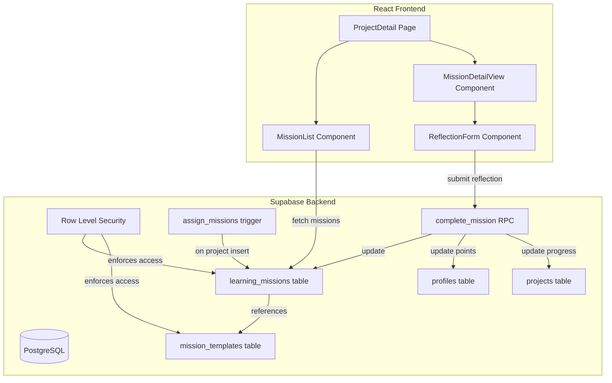

# Design Document: Learning Missions

## Overview

El sistema de Misiones de Aprendizaje reemplaza la sección "Hitos del Proyecto" en la página `ProjectDetail` con un flujo de aprendizaje guiado. Cada misión contiene contenido educativo sobre emprendimiento social y requiere que el emprendedor escriba una reflexión de al menos 50 caracteres explicando cómo aplica la lección a su proyecto.

El diseño sigue la arquitectura existente del proyecto: React + TypeScript en el frontend con CSS Modules, Supabase como backend (base de datos PostgreSQL con RLS, auth), y el patrón de consulta directa al cliente Supabase que ya usa la app.

### Decisiones clave de diseño

1. **Sin backend separado** — Se usa Supabase client-side con RLS para seguridad, consistente con el resto de la app.
2. **Asignación via trigger SQL** — Las misiones se asignan automáticamente con un trigger `AFTER INSERT` en la tabla `projects`, evitando lógica extra en el frontend.
3. **Cálculo de progreso en función SQL** — El progreso se calcula con una función RPC en Supabase que se invoca al completar una misión, garantizando consistencia.
4. **Componentes dentro de la página existente** — Las misiones se integran directamente en `ProjectDetail` como una nueva sección, sin crear una ruta nueva.

## Architecture



### Flujo principal

1. **Creación de proyecto** → Trigger SQL crea instancias de `learning_missions` para cada template activo.
2. **Vista de proyecto** → `ProjectDetail` carga misiones y muestra `MissionList`.
3. **Selección de misión** → Se expande `MissionDetailView` mostrando lección y formulario.
4. **Envío de reflexión** → `ReflectionForm` valida (≥50 chars) y llama a RPC `complete_mission`.
5. **RPC `complete_mission`** → En una transacción: guarda reflexión, marca completada, suma puntos, recalcula progreso y nivel.

## Components and Interfaces

### Nuevos tipos TypeScript (`src/types/database.ts`)

```typescript
export interface MissionTemplate {
  id: string;
  title: string;
  lesson_content: string;
  suggested_order: number;
  points_awarded: number;
  is_active: boolean;
  created_at: string;
}

export interface LearningMission {
  id: string;
  project_id: string;
  mission_template_id: string;
  reflection: string | null;
  completed: boolean;
  completed_at: string | null;
  created_at: string;
  // Joined from mission_templates
  mission_template?: MissionTemplate;
}
```

### Componentes React

#### `MissionList` (`src/components/missions/MissionList.tsx`)

```typescript
interface MissionListProps {
  missions: LearningMission[];
  onSelectMission: (mission: LearningMission) => void;
  selectedMissionId?: string;
}
```

Responsabilidades:
- Renderizar lista ordenada por `suggested_order`
- Mostrar título, estado (completada/pendiente), puntos
- Mostrar resumen "X de Y misiones completadas"
- Mostrar snippet de reflexión (primeros 80 caracteres) para misiones completadas
- Distinguir visualmente completadas vs pendientes

#### `MissionDetailView` (`src/components/missions/MissionDetailView.tsx`)

```typescript
interface MissionDetailViewProps {
  mission: LearningMission;
  onComplete: () => void;
}
```

Responsabilidades:
- Mostrar título y contenido de la lección en párrafos legibles
- Si completada: mostrar reflexión en modo lectura con fecha de completación
- Si pendiente: mostrar `ReflectionForm`

#### `ReflectionForm` (`src/components/missions/ReflectionForm.tsx`)

```typescript
interface ReflectionFormProps {
  missionId: string;
  onSubmitSuccess: () => void;
}
```

Responsabilidades:
- Textarea para escribir reflexión
- Contador de caracteres con indicador de mínimo (50)
- Botón "Completar Misión" deshabilitado si < 50 caracteres
- Mensaje de validación si se intenta enviar con texto insuficiente
- Llamar a RPC `complete_mission` al enviar
- Mostrar estados de carga y error

### Integración en `ProjectDetail`

La sección actual "Hitos del Proyecto" se reemplaza por la sección "Misiones de Aprendizaje":

```typescript
// En ProjectDetail.tsx, reemplazar la sección de milestones por:
<section className={styles.section}>
  <h2>Misiones de Aprendizaje</h2>
  <MissionList 
    missions={missions} 
    onSelectMission={setSelectedMission}
    selectedMissionId={selectedMission?.id}
  />
  {selectedMission && (
    <MissionDetailView 
      mission={selectedMission}
      onComplete={reloadMissions}
    />
  )}
</section>
```

### Función RPC de Supabase: `complete_mission`

```sql
CREATE OR REPLACE FUNCTION complete_mission(
  p_mission_id UUID,
  p_reflection TEXT
) RETURNS VOID AS $$
DECLARE
  v_project_id UUID;
  v_points INTEGER;
  v_user_id UUID;
  v_total_missions INTEGER;
  v_completed_missions INTEGER;
  v_progress INTEGER;
  v_level TEXT;
BEGIN
  -- Validate reflection length
  IF LENGTH(p_reflection) < 50 THEN
    RAISE EXCEPTION 'Reflection must be at least 50 characters';
  END IF;

  -- Get mission details and verify not already completed
  SELECT lm.project_id, mt.points_awarded
  INTO v_project_id, v_points
  FROM learning_missions lm
  JOIN mission_templates mt ON mt.id = lm.mission_template_id
  WHERE lm.id = p_mission_id AND lm.completed = false;

  IF NOT FOUND THEN
    RAISE EXCEPTION 'Mission not found or already completed';
  END IF;

  -- Get project owner
  SELECT user_id INTO v_user_id FROM projects WHERE id = v_project_id;

  -- Mark mission complete
  UPDATE learning_missions
  SET reflection = p_reflection,
      completed = true,
      completed_at = NOW()
  WHERE id = p_mission_id;

  -- Award points
  UPDATE profiles
  SET points = points + v_points
  WHERE user_id = v_user_id;

  -- Recalculate progress
  SELECT COUNT(*), COUNT(*) FILTER (WHERE completed = true)
  INTO v_total_missions, v_completed_missions
  FROM learning_missions
  WHERE project_id = v_project_id;

  v_progress := ROUND((v_completed_missions::NUMERIC / v_total_missions) * 100);

  -- Determine level
  v_level := CASE
    WHEN v_progress >= 75 THEN 'bosque'
    WHEN v_progress >= 50 THEN 'arbol'
    WHEN v_progress >= 25 THEN 'brote'
    ELSE 'semilla'
  END;

  -- Update project
  UPDATE projects
  SET progress_percentage = v_progress,
      level = v_level
  WHERE id = v_project_id;
END;
$$ LANGUAGE plpgsql SECURITY DEFINER;
```

### Trigger de asignación automática

```sql
CREATE OR REPLACE FUNCTION assign_missions_to_project()
RETURNS TRIGGER AS $$
BEGIN
  INSERT INTO learning_missions (project_id, mission_template_id)
  SELECT NEW.id, mt.id
  FROM mission_templates mt
  WHERE mt.is_active = true;
  
  RETURN NEW;
EXCEPTION WHEN OTHERS THEN
  -- Log error but don't block project creation
  RAISE WARNING 'Failed to assign missions to project %: %', NEW.id, SQLERRM;
  RETURN NEW;
END;
$$ LANGUAGE plpgsql;

CREATE TRIGGER trg_assign_missions
AFTER INSERT ON projects
FOR EACH ROW
EXECUTE FUNCTION assign_missions_to_project();
```

## Data Models

### Tabla: `mission_templates`

| Column | Type | Constraints | Default |
|--------|------|-------------|---------|
| id | UUID | PRIMARY KEY | gen_random_uuid() |
| title | TEXT | NOT NULL | — |
| lesson_content | TEXT | NOT NULL | — |
| suggested_order | INTEGER | NOT NULL | — |
| points_awarded | INTEGER | NOT NULL | 15 |
| is_active | BOOLEAN | NOT NULL | true |
| created_at | TIMESTAMPTZ | NOT NULL | NOW() |

### Tabla: `learning_missions`

| Column | Type | Constraints | Default |
|--------|------|-------------|---------|
| id | UUID | PRIMARY KEY | gen_random_uuid() |
| project_id | UUID | NOT NULL, FK → projects(id) ON DELETE CASCADE | — |
| mission_template_id | UUID | NOT NULL, FK → mission_templates(id) | — |
| reflection | TEXT | NULLABLE | NULL |
| completed | BOOLEAN | NOT NULL | false |
| completed_at | TIMESTAMPTZ | NULLABLE | NULL |
| created_at | TIMESTAMPTZ | NOT NULL | NOW() |

**Índices:**
- `idx_learning_missions_project_id` en `project_id` para consultas por proyecto
- Unique constraint en `(project_id, mission_template_id)` para evitar duplicados

### Row Level Security

```sql
-- learning_missions: solo el dueño del proyecto puede ver y actualizar
ALTER TABLE learning_missions ENABLE ROW LEVEL SECURITY;

CREATE POLICY "Project owner can view own missions"
ON learning_missions FOR SELECT
USING (
  project_id IN (
    SELECT id FROM projects WHERE user_id = auth.uid()
  )
);

CREATE POLICY "Project owner can update own missions"
ON learning_missions FOR UPDATE
USING (
  project_id IN (
    SELECT id FROM projects WHERE user_id = auth.uid()
  )
);

-- mission_templates: todos autenticados leen, solo admin modifica
ALTER TABLE mission_templates ENABLE ROW LEVEL SECURITY;

CREATE POLICY "Authenticated users can read templates"
ON mission_templates FOR SELECT
TO authenticated
USING (true);

CREATE POLICY "Admin can modify templates"
ON mission_templates FOR ALL
USING (
  EXISTS (SELECT 1 FROM profiles WHERE user_id = auth.uid() AND role = 'admin')
);
```

### Seed Data (8 misiones)

Las 8 misiones se insertan con contenido educativo en español (es-MX) cubriendo:
1. Identifica el problema social que resuelves (order: 1)
2. Define tu propuesta de valor social (order: 2)
3. Mapea a tus beneficiarios directos (order: 3)
4. Diseña tu modelo de ingresos sostenible (order: 4)
5. Valida tu idea con 5 personas reales (order: 5)
6. Crea tu primer prototipo o MVP (order: 6)
7. Mide tu impacto social inicial (order: 7)
8. Construye tu equipo fundador (order: 8)

Cada una con `lesson_content` de 2-3 párrafos explicando el concepto y guiando la reflexión.


## Correctness Properties

*A property is a characteristic or behavior that should hold true across all valid executions of a system — essentially, a formal statement about what the system should do. Properties serve as the bridge between human-readable specifications and machine-verifiable correctness guarantees.*

### Property 1: Mission assignment completeness

*For any* set of N active mission templates and a newly created project, the system shall create exactly N learning mission instances, one per active template, all with `completed = false` and `reflection = null`.

**Validates: Requirements 3.1, 3.2, 3.3**

### Property 2: Reflection validation boundary

*For any* string with fewer than 50 characters (including null, empty, and whitespace-only strings), the completion action shall be disabled and submission shall be rejected. *For any* string with 50 or more characters, the completion action shall be enabled and submission shall be accepted.

**Validates: Requirements 5.2, 6.1, 6.2, 6.3**

### Property 3: Completion round-trip

*For any* valid reflection text (≥ 50 characters) submitted for an incomplete mission, the system shall persist the exact reflection text, set `completed = true`, and record a non-null `completed_at` timestamp.

**Validates: Requirements 5.1, 5.4**

### Property 4: Completed mission immutability

*For any* completed learning mission, attempts to modify the reflection text shall be rejected, and the reflection, completion status, and timestamp shall remain unchanged.

**Validates: Requirements 5.5**

### Property 5: Points accuracy

*For any* learning mission with an associated template containing `points_awarded = P`, completing the mission shall increase the entrepreneur's profile points by exactly P.

**Validates: Requirements 7.1, 7.2**

### Property 6: Points idempotence

*For any* already-completed learning mission, attempting to complete it again shall not change the entrepreneur's profile points total.

**Validates: Requirements 7.3**

### Property 7: Progress calculation correctness

*For any* project with T total missions and C completed missions, the progress_percentage shall equal `ROUND(C / T * 100)`.

**Validates: Requirements 8.1, 8.3**

### Property 8: Level determination from progress

*For any* progress_percentage value, the project level shall be: "semilla" if 0–24%, "brote" if 25–49%, "arbol" if 50–74%, "bosque" if 75–100%.

**Validates: Requirements 8.2**

### Property 9: Mission list ordering

*For any* set of learning missions displayed in the list, the order shall match the ascending `suggested_order` values of their associated templates.

**Validates: Requirements 9.1**

### Property 10: Summary count accuracy

*For any* set of missions with C completed out of T total, the summary display shall show the text "C de T misiones completadas" with correct values.

**Validates: Requirements 9.4**

### Property 11: Reflection snippet truncation

*For any* reflection text, the preview snippet in the mission list shall contain exactly the first 80 characters of the reflection (or the full text if it has fewer than 80 characters).

**Validates: Requirements 10.3**

## Error Handling

### Errores de red / Supabase

| Escenario | Comportamiento |
|-----------|---------------|
| Fallo al cargar misiones | Mostrar mensaje "Error al cargar misiones" con botón de reintentar |
| Fallo al enviar reflexión | Mostrar toast de error, mantener texto en textarea para reintentar |
| RPC `complete_mission` falla | Revertir UI al estado previo, mostrar mensaje de error |
| Timeout de red | Mostrar indicador de carga por máximo 10s, luego mensaje de error |

### Errores de validación

| Escenario | Comportamiento |
|-----------|---------------|
| Reflexión < 50 caracteres | Mostrar "Tu reflexión debe tener al menos 50 caracteres" bajo el textarea |
| Misión ya completada | El botón no aparece (UI en modo lectura); RPC rechaza si se invoca directamente |
| Proyecto no encontrado | Redirigir a lista de proyectos |

### Errores de asignación de misiones

| Escenario | Comportamiento |
|-----------|---------------|
| Trigger falla al crear misiones | Proyecto se crea exitosamente, se registra WARNING en logs de PostgreSQL |
| No hay templates activos | Proyecto se crea sin misiones, sección muestra estado vacío "No hay misiones disponibles" |

### Estados de carga

- Skeleton loader mientras se cargan misiones
- Spinner en botón "Completar Misión" durante envío
- Textarea deshabilitado durante envío para prevenir doble-submit

## Testing Strategy

### Enfoque dual: Unit Tests + Property-Based Tests

La estrategia de testing combina tests de ejemplo para casos específicos y tests de propiedades para validación universal.

#### Property-Based Testing

**Librería:** [fast-check](https://github.com/dubzzz/fast-check) para TypeScript/JavaScript

**Configuración:**
- Mínimo 100 iteraciones por propiedad
- Cada test referencia su propiedad del documento de diseño

**Propiedades a implementar:**

1. **Validation boundary** (Property 2): Generar strings de longitud 0-200, verificar que el resultado de validación coincide con length ≥ 50.
   - Tag: `Feature: learning-missions, Property 2: Reflection validation boundary`

2. **Progress calculation** (Property 7): Generar pares (total, completed) donde 1 ≤ completed ≤ total ≤ 100, verificar fórmula.
   - Tag: `Feature: learning-missions, Property 7: Progress calculation correctness`

3. **Level determination** (Property 8): Generar porcentajes 0-100, verificar nivel correcto.
   - Tag: `Feature: learning-missions, Property 8: Level determination from progress`

4. **Mission list ordering** (Property 9): Generar arrays de misiones con órdenes aleatorios, verificar que el sort produce orden ascendente.
   - Tag: `Feature: learning-missions, Property 9: Mission list ordering`

5. **Summary count** (Property 10): Generar listas de misiones con estados aleatorios, verificar texto de resumen.
   - Tag: `Feature: learning-missions, Property 10: Summary count accuracy`

6. **Snippet truncation** (Property 11): Generar strings de longitud 0-500, verificar truncamiento correcto a 80 chars.
   - Tag: `Feature: learning-missions, Property 11: Reflection snippet truncation`

#### Unit Tests (Example-Based)

- Completar misión: verificar que RPC actualiza todos los campos correctamente
- Inmutabilidad: intentar actualizar misión completada, verificar rechazo
- Puntos: completar misión, verificar incremento exacto en perfil
- Idempotencia: completar misión dos veces, verificar puntos no duplicados
- Trigger: crear proyecto, verificar N misiones creadas con estado inicial correcto
- Cascade delete: eliminar proyecto, verificar misiones eliminadas
- Defaults: insertar template sin points_awarded, verificar default 15

#### Integration Tests

- RLS: verificar que usuario A no puede ver misiones de usuario B
- RLS: verificar que non-admin no puede modificar templates
- Seed: verificar que las 8 misiones existen con contenido correcto
- Flujo completo: crear proyecto → ver misiones → completar misión → verificar puntos y progreso

#### Archivos de test

```
src/
├── lib/
│   ├── missions.ts              # Lógica pura (validación, cálculos)
│   └── missions.test.ts         # Unit + property tests
├── components/
│   └── missions/
│       ├── MissionList.test.tsx  # Component tests
│       └── ReflectionForm.test.tsx
└── ...
```
